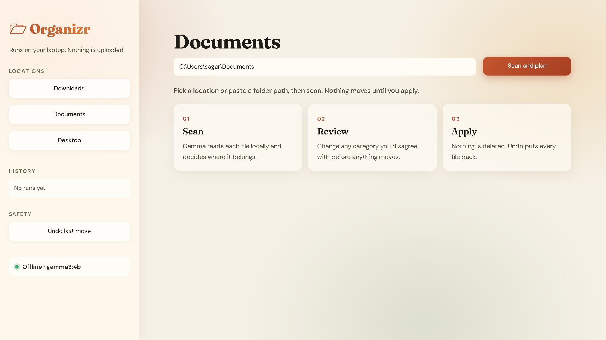
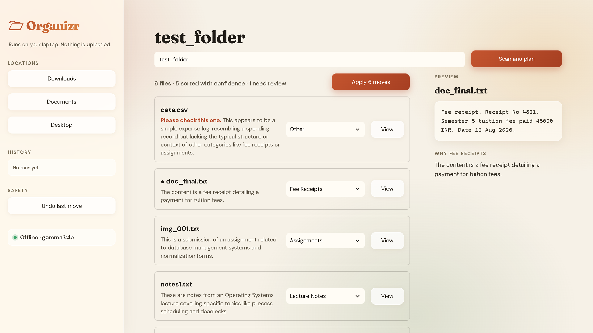
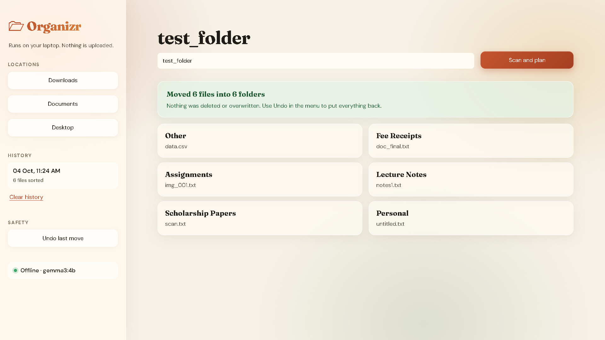
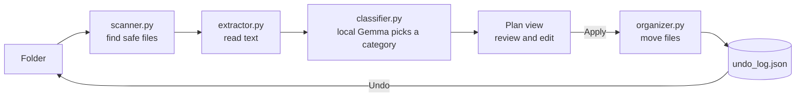
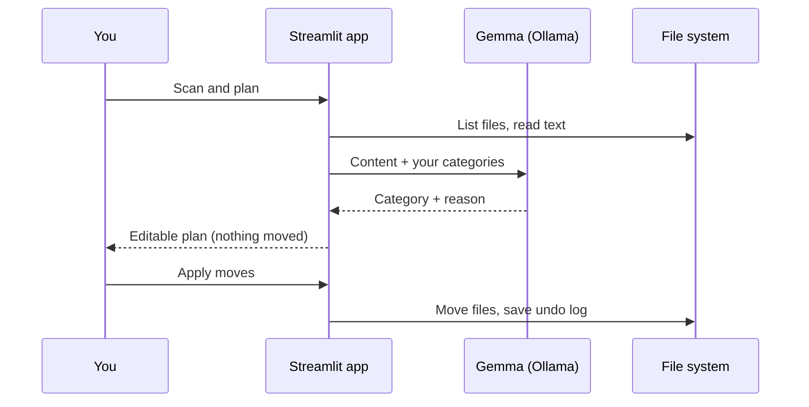

<h1 align="center">🗁 Organizr</h1>

<p align="center">
  <b>An offline AI file organizer that sorts your files by what's inside them, not by their extension.</b><br>
  It reads each document with a local open-weight model (Gemma via Ollama), proposes where it belongs,<br>
  and moves files only after you approve. Your private files never leave your laptop.
</p>

<p align="center">
  <a href="#the-problem">Problem</a> ·
  <a href="#the-solution">Solution</a> ·
  <a href="#how-it-works">How it works</a> ·
  <a href="#getting-started">Getting started</a> ·
  <a href="#project-structure">Structure</a> ·
  <a href="#limitations">Limitations</a>
</p>

<p align="center">🎃 Built for the <b>DEV Hacktoberfest Weekend Challenge: Build for a Friend.</b></p>

---

## The Problem

Downloads folders turn into a dumping ground. This project started with a friend whose folder mixed lecture PDFs, fee receipts, assignment files, scholarship letters and random images, all with names like `doc_final.pdf` and `scan (3).pdf`.

Existing options did not fit:

- **Extension-based sorters** put every PDF in one folder, so a fee receipt lands next to lecture notes.
- **Cloud AI tools** would mean uploading ID scans, marksheets and bank statements to someone else's server.
- **Doing it by hand** works once, then the mess returns.

## The Solution

Organizr reads the **content** of each file and suggests the folder it belongs in, using a model that runs entirely on your own machine.

- **Content-aware:** a file called `img_001.txt` that contains a DBMS assignment goes to *Assignments*.
- **Private by design:** works with Wi-Fi turned off, with no API keys and no uploads.
- **You stay in control:** you review a plan first, edit any category, then apply. Every move can be undone.
- **Your categories:** folders are defined in a plain JSON file, so it adapts to anyone's life.

## See it in action

<table align="center">
  <tr>
    <td align="center"><br><b>Home</b></td>
  </tr>
</table>

<table align="center">
  <tr>
    <td align="center"><br><b>Plan</b></td>
    <td align="center"><br><b>Done</b></td>
  </tr>
</table>
<!--
Add screenshots to docs/screenshots/, then uncomment:


-->

1. Pick a location (Downloads, Documents, Desktop) or paste a folder path, then click **Scan and plan**.
2. Review the plan, with a short reason from Gemma for every file.
3. Click **View** on any file to preview its text next to the decision.
4. Change any category you disagree with, then click **Apply moves**.
5. Changed your mind? Click **Undo last move** and everything goes back.

## How it works



Nothing is moved until you click Apply:



## Why open-source AI?

| | Cloud AI | Organizr (local Gemma) |
|---|---|---|
| Your documents | Uploaded to a server | Stay on your laptop |
| Cost | Per-request billing | Free after download |
| Internet needed | Yes | No |
| Model choice | Fixed by provider | Swap with one line |

## Features

- Reads PDF, DOCX, TXT, MD, CSV and JSON files
- Classifies by content and ignores misleading filenames
- Editable plan with a reason for every decision and a text preview per file
- Dry run by default, with one-click undo and a run history
- Safe moves: never deletes, never overwrites (collisions get `_1`, `_2`)
- Skips unfinished downloads (`.crdownload`, `.tmp`) and files changed in the last 5 minutes
- Responsive interface that works on desktop, tablet and phone-sized windows
- Fully customizable categories

## Getting started

**Requirements:** Python 3.10+, [Ollama](https://ollama.com), and about 5 GB of free RAM for the 4B model.

```bash
# 1. Get the code
git clone https://github.com/mauryasagar/ai-file-organizer.git
cd ai-file-organizer

# 2. Install dependencies
python -m venv .venv
# Windows: .venv\Scripts\activate    macOS/Linux: source .venv/bin/activate
pip install -r requirements.txt

# 3. Download the model
ollama pull gemma3:4b

# 4. Run
streamlit run app.py
```

To use a different model, change `MODEL` in `classifier.py`. `gemma3:1b` is faster but less accurate.

### Make it yours

Edit `categories.json` to match your own folders:

```json
["Lecture Notes", "Fee Receipts", "Assignments", "Scholarship Papers", "Personal", "Other"]
```

## Project structure

```
ai-file-organizer/
├── app.py              # Streamlit interface: plan, preview, apply, undo, history
├── scanner.py          # Finds files, skips temp and recent downloads
├── extractor.py        # Pulls the first ~1000 characters of text
├── classifier.py       # Asks local Gemma for a category and a reason
├── organizer.py        # Builds the plan, moves files safely, undo
├── categories.json     # Your folder categories
├── requirements.txt
├── static/
│   └── style.css       # App styling
├── docs/
│   └── screenshots/    # Images used in this README
├── .streamlit/
│   └── config.toml     # App theme
├── LICENSE
└── README.md
```

## Limitations

- Borderline files sometimes land in "Other" (for example a personal expense CSV)
- Scanned PDFs and image-only files need OCR, which is not included yet
- Only files directly inside the chosen folder are scanned, not subfolders
- Gemma's wording of reasons varies slightly from run to run

## Built with

Python · Ollama · Gemma · Streamlit · PyMuPDF · python-docx · pandas

## Built for a friend

> 🎃 Made for the **DEV Hacktoberfest Weekend Challenge: Build for a Friend**.

The goal was to solve one real person's problem with open-source AI, and to keep her private files private.

## License

MIT