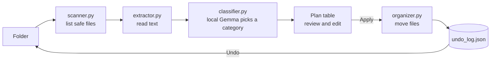
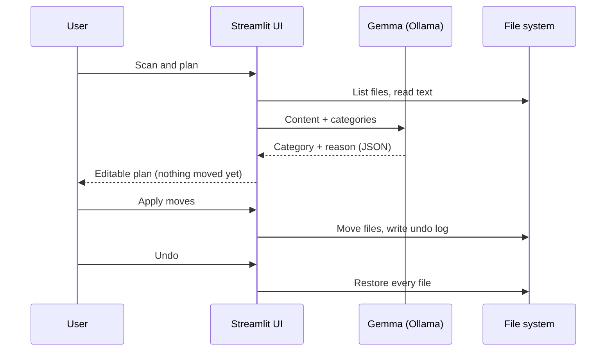

# 📁 Organizr

**An offline AI file organizer that sorts by what's *inside* your files, not by their extension.**

Your Downloads folder is full of private things: fee receipts, ID scans, marksheets, bank statements. Organizr reads each file with a local open-weight model (Gemma via Ollama), proposes where it belongs, and moves files only after you approve. Nothing is uploaded anywhere.

Built for a friend with a chaotic Downloads folder, for the DEV Hacktoberfest Weekend Challenge: *Build for a Friend*.

## Why open-source AI?
- **Privacy:** documents never leave the laptop. It works with Wi-Fi off.
- **Cost:** no API keys, no per-file charges.
- **Control:** categories live in a plain JSON file, and the model can be swapped by changing one line (`gemma3:1b` and `gemma3:4b` were both tested).

## How it works





## Project structure

```
ai-file-organizer/
├── app.py              # Streamlit interface (plan table, apply, undo)
├── scanner.py          # Finds files; skips temp/partial/recent downloads
├── extractor.py        # Pulls the first ~1000 chars from PDF, DOCX, TXT, CSV...
├── classifier.py       # Sends content to local Gemma, returns category + reason
├── organizer.py        # Builds the plan, moves files safely, undo
├── categories.json     # Your folders, edit freely
├── requirements.txt
├── .streamlit/
│   └── config.toml     # Dark purple theme
└── README.md
```

## Run it

1. Install [Ollama](https://ollama.com) and pull a model:
```
   ollama pull gemma3:4b
```
2. Install dependencies:
```
   pip install -r requirements.txt
```
3. Edit `categories.json` to match your own life.
4. Start the app:
```
   streamlit run app.py
```
   To use a different model, change `MODEL` in `classifier.py`.

## Safety by design
- **Dry run first:** nothing moves until you click Apply.
- **Editable plan:** you can change any category before applying.
- **Never deletes or overwrites:** name collisions get `_1`, `_2` suffixes.
- **Skips risky files:** `.crdownload`, `.tmp`, and anything modified in the last 5 minutes.
- **One-click undo** from a saved move log.

## Tested on
A mixed set of notes, receipts, assignments, scholarship letters and personal files with deliberately misleading names (`doc_final.txt`, `img_001.txt`).

| Model | Correct on test set | Notes |
|---|---|---|
| gemma3:1b | 4 / 6 | Fast, but confused by borderline files |
| gemma3:4b | 5 / 6 | More accurate; slower on CPU |

## Known limitations
- Small models sometimes choose "Other" for borderline files (e.g. a personal expense CSV).
- Image-only files and scanned PDFs need OCR, which is not included yet.
- Only the files directly inside the folder are scanned (no subfolders).

## Roadmap
- OCR for scans and screenshots
- "Find my file" search by meaning
- Per-user category presets

## Tech
Python, Ollama, Gemma, PyMuPDF, python-docx, pandas, Streamlit.

## License
MIT